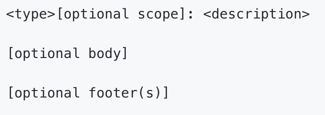

# Conventional Commits

This is what is included in a commit object:

### Type

These are predefined keys that we can use to organize our commit messages. Popular types include:

- **feat**: use when creating a new feature
- **fix**: use when fixing a bug
- **chore**: use when formatting or bumping versions
- **docs**: use when adding documentation
- **refactor**: use when refactoring existing code
- **perf**: use when improving performance
- **test**: use when adding tests

[More info on conventional commits](https://www.conventionalcommits.org/en/v1.0.0/#summary)

### Best Practices 
Try to commit early and often.

When writing commit messages, use present tense verbs.

examples:
- add instead of added
- edit instead of edited
- create instead of created